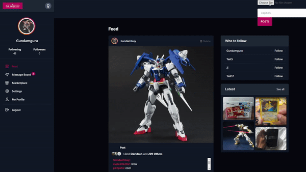
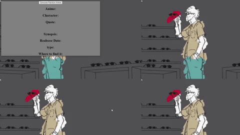
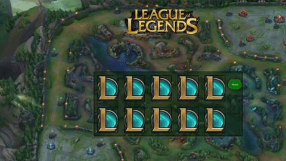

  
  
  
  

Boston Based Full Stack Software Engineer

"Just like taking a picture, while coding I am able to transform nothing into a full masterpiece. I make the invisible, visible."

See [my website](https://kevincharlesdev.com) for more information!

---

## Projects
<table bordercolor="#66b2b2">
  <tr>
    <td width="33%" valign="top">
      <h3>The Hobbyist</h3>
         
        
<a target="_blank" href="https://github.com/SEKev95/the-hobbyist">Repo</a> // <a target="_blank" href="https://the-hobbyist.herokuapp.com/">Site</a>

         
        
        
<strong>Javascript, Bootstrap, mongodb, & Node.js</strong> - Social Media platform created for people who have collections that they would want to show off or even sell items.

    </td>
    <td width="33%" valign="top">
      <h3>Photo Blog</h3>
         
        
<a target="_blank" href="https://kevincblog.netlify.app/">Site</a>

         
        
        
<strong>HTML5, CSS3, Javascript</strong> - Personal photography page.

    </td>
  </tr>
</table>
<table>
  <tr>
    <td width="33%" valign="top">
      <h3>Anime Generator</h3>
         
        
<a target="_blank" href="https://github.com/SEKev95/complex-api-bootcamp/tree/answer">Repo</a> // <a target="_blank" href="https://kevincanimeapi.netlify.app/">Site</a>

         
        
        
<strong>Javascript & API</strong> - Need a new anime show to watch? Use the Anime generator to find some new content to watch..

    </td>
    <td width="33%" valign="top">
      <h3>Matching Cards</h3>
         
        
<a target="_blank" href="https://github.com/SEKev95/matching-card-bootcamp/tree/answer">Repo</a> // <a target="_blank" href="https://kevincardmatching.netlify.app/">Site</a>

         
        
        
<strong>HTML5, CSS3, & Javascript</strong> - Test your memory with my favorite game, League of Legends!

    </td>
  </tr>
</table>
